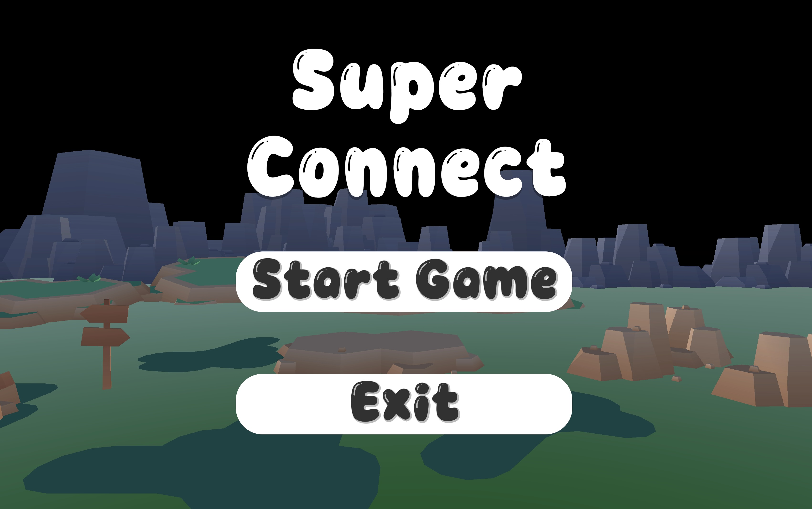
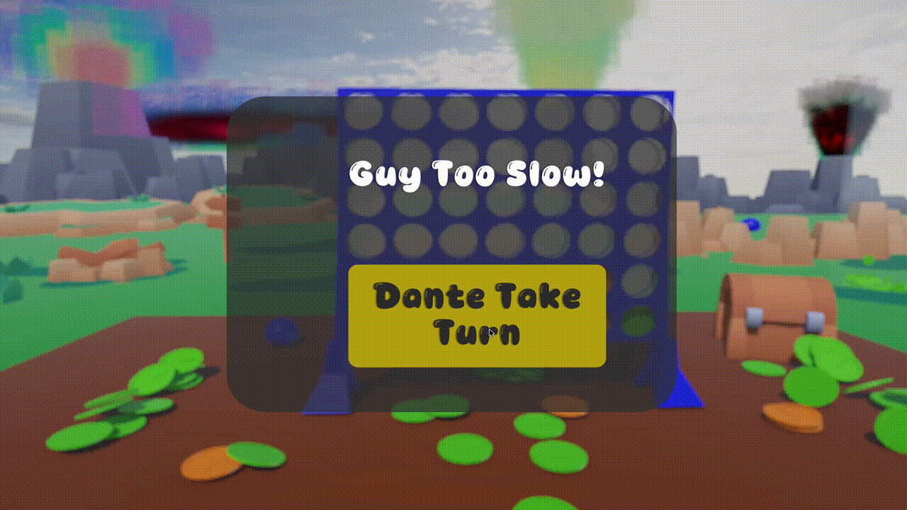

# Super Connect

A two-player turn-based Connect 4–style game built in Unity 6 (URP). Get four in a row: horizontally, vertically, or diagonally to win.

Full game with start scene, player naming, scoring, winning screen, music control, 3D background and animations.

---

## Check it out

### Menu Screen


### Coin dropping gameplay


### Hidden easter egg showing celebration animations


---

## Features

- **Full game flow**: Main menu → player naming → game scene → win/draw screen
- **Player names**: Enter names for both players before starting; names and scores are shown in-game
- **6×7 board**: Standard Connect 4 grid with column hover preview (ghost piece) and physics-based dropping
- **Turn timer**: Configurable per-turn countdown; “Too Slow” penalty if time runs out (opponent gets the turn)
- **Win detection**: Horizontal, vertical, and both diagonals; win circles and celebration effects
- **Draw detection**: Full board with no winner
- **Score tracking**: Persistent scores across rounds; first to 15 wins can trigger tower destruction
- **Win celebrations**: Coin spray (regular + special), optional explosion at 3 wins, sun rotation
- **Audio**: Background music (shuffle/next, volume control), button clicks, turn sounds, win/draw jingles
- **3D environment**: Animated sun, moving lights, camera fly on main menu, blur and swirl UI effects
- **Menus**: Pause (start game, set timer, restart, main menu), settings, “Too Slow” continue

---

## Requirements

- **Unity 6** (tested with 6000.0.25f1)
- **Apple Silicon** compatible (Unity 6 Silicon)
- Packages (from `Packages/manifest.json`): URP, Input System, Post Processing, UI (UGUI), Visual Scripting, 2D Sprite, Timeline, and others as per manifest

---

## Project structure

```
Assets/
├── Scenes/
│   ├── MainMenuScreen.unity   # Start screen, player name input
│   └── GameScene.unity        # Connect 4 game
├── Scripts/
│   ├── GameManager.cs         # Board state, turns, win/draw, pause, timer, celebrations
│   ├── MainMenu3.cs           # Main menu and name-input flow
│   ├── CountdownSlider.cs     # Per-turn timer; triggers “Too Slow”
│   ├── PlayerVisual.cs        # Player turn indicator (opacity)
│   ├── InputFields.cs         # Column input + blur
│   ├── AudioPlayer.cs         # Music and SFX (game scene)
│   ├── AudioPlayerMenu.cs     # Menu audio
│   ├── MainMenuCamaraFly.cs   # Main menu camera
│   ├── SunMove.cs / LightMove.cs
│   ├── UnderlaySwirlEffect.cs / BlurEffect.cs
│   └── ...
├── Fonts/
└── UI/
```

---

## How to run

1. Open the project in **Unity 6** (Hub or directly).
2. Open **MainMenuScreen** (Scene 0) or **GameScene** (Scene 1).
3. Press **Play** in the Editor.
4. From the main menu: Start → enter both player names → Start Game. In-game: use pause menu to set the turn timer and start the round.
